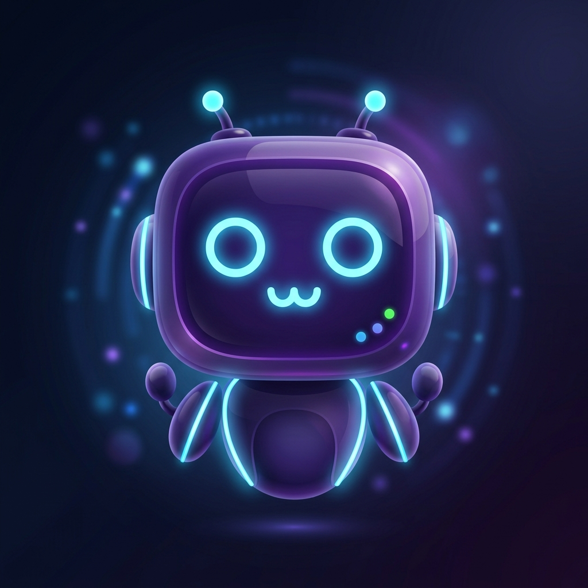
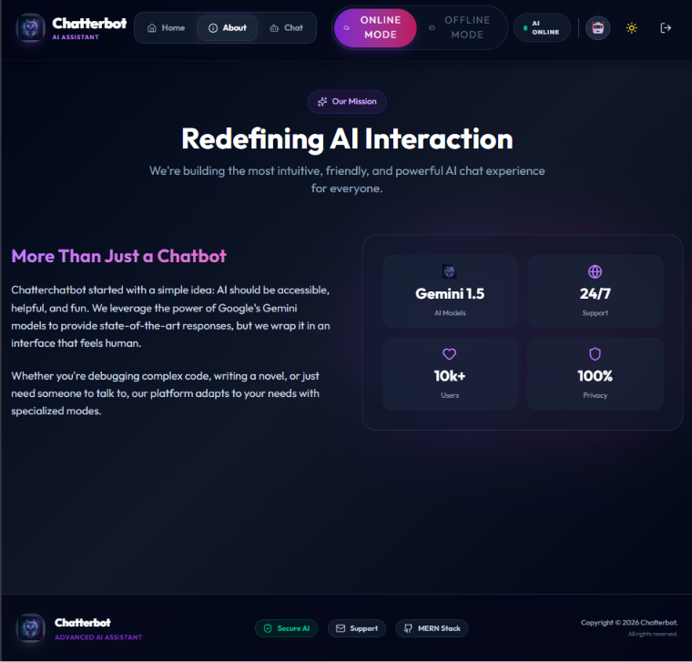
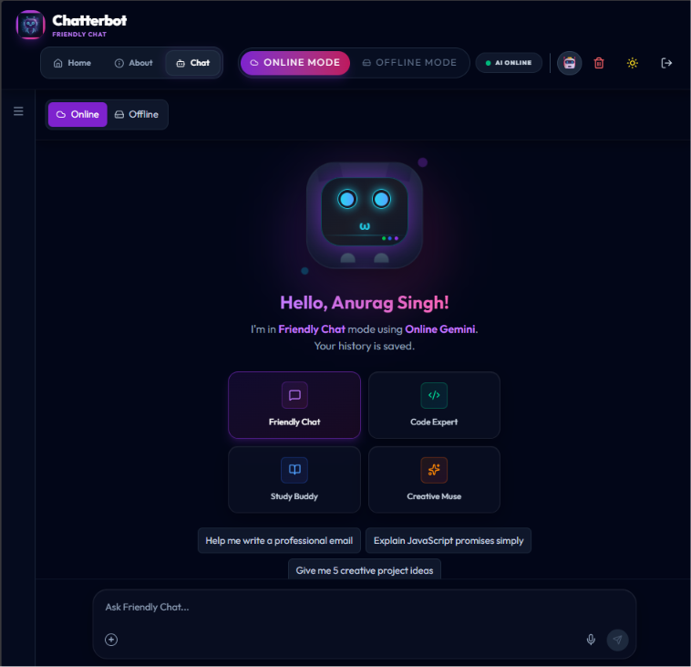
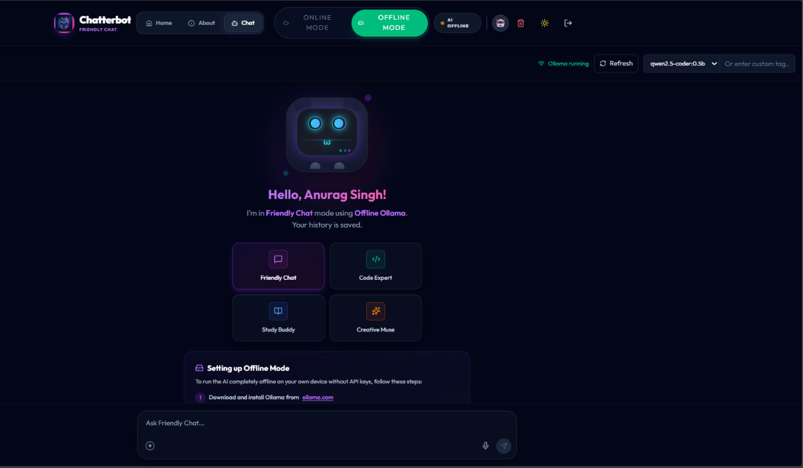

<div align="center">



# 🤖 Chatterbot — AI Assistant

**A production-ready, full-stack AI Chatbot powered by Google Gemini & Ollama**

[](https://choosealicense.com/licenses/mit/)
[](https://nodejs.org/)
[](https://react.dev/)
[](https://www.mongodb.com/)
[](https://expressjs.com/)
[](https://vitejs.dev/)
[](https://ai.google.dev/)

[🌐 Live Demo](#) · [🐛 Report Bug](https://github.com/anuragsinghrajput123456789/Ai-Chatbot/issues) · [✨ Request Feature](https://github.com/anuragsinghrajput123456789/Ai-Chatbot/issues)

</div>

---

## 📸 App Screenshots

<table>
  <tr>
    <td align="center" width="33%">
      
      <br/><br/>
      <strong>🏠 Home — Hero Section</strong><br/>
      <em>Modern landing with animated AI robot, mode switcher, and prompt preview</em>
    </td>
    <td align="center" width="33%">
      
      <br/><br/>
      <strong>ℹ️ About — Mission Page</strong><br/>
      <em>Mission statement, live stats (Gemini 1.5, 10k+ Users, 24/7, 100% Privacy)</em>
    </td>
    <td align="center" width="33%">
      
      <br/><br/>
      <strong>💬 Chat — Interface</strong><br/>
      <em>4 specialized AI modes: Friendly Chat, Code Expert, Study Buddy, Creative Muse</em>
    </td>
  </tr>
  <tr>
    <td align="center" colspan="1">
      
      <br/><br/>
      <strong>🌐 Online Mode — Gemini AI</strong><br/>
      <em>Cloud-powered responses with persistent chat history</em>
    </td>
    <td align="center" colspan="1">
      
      <br/><br/>
      <strong>🔌 Offline Mode — Ollama</strong><br/>
      <em>100% local AI — no internet, no data shared</em>
    </td>
    <td align="center" colspan="1">
      
      <br/><br/>
      <strong>🤖 Chat Mode Selection</strong><br/>
      <em>Pick from Friendly Chat, Code Expert, Study Buddy, or Creative Muse</em>
    </td>
  </tr>
</table>

---

## 🧭 Table of Contents

- [✨ Features](#-features)
- [⚙️ Tech Stack](#️-tech-stack)
- [📁 Folder Structure](#-folder-structure)
- [🚀 Getting Started](#-getting-started)
- [🌐 Online Mode — Google Gemini](#-online-mode--google-gemini)
- [🔌 Offline Mode — Ollama](#-offline-mode--ollama)
- [🤖 AI Chat Modes](#-ai-chat-modes)
- [🔐 API Routes](#-api-routes)
- [🛡️ Security Features](#️-security-features)
- [🌍 Environment Variables](#-environment-variables)
- [📦 Deployment](#-deployment)
- [🤝 Contributing](#-contributing)

---

## ✨ Features

<table>
  <tr>
    <td>🚀</td>
    <td><strong>GPU Scroll Acceleration</strong></td>
    <td>Native browser smooth-scrolling backed by hardware-accelerated compositor layers (`will-change: transform`), guaranteeing 60fps jitter-free layout pans.</td>
  </tr>
  <tr>
    <td>💬</td>
    <td><strong>Symmetric Conversational UI</strong></td>
    <td>Redesigned dialogue alignment (User responses right-symmetrical, Bot messages left-aligned inside elegant glassmorphic cards) complete with glowing visual avatars.</td>
  </tr>
  <tr>
    <td>🌐</td>
    <td><strong>Online Mode (Gemini 2.5/1.5)</strong></td>
    <td>Blazing-fast cloud-powered intelligence via Google Gemini direct endpoints with OpenRouter API automatic fallbacks.</td>
  </tr>
  <tr>
    <td>🔌</td>
    <td><strong>Offline Mode (Ollama)</strong></td>
    <td>100% on-device AI — the browser talks directly to the user's local Ollama at <code>localhost:11434</code>. No ngrok, no remote servers. Conversations never leave the user's machine.</td>
  </tr>
  <tr>
    <td>🤖</td>
    <td><strong>4 Specialized AI Modes</strong></td>
    <td>Friendly Chat, Code Expert, Study Buddy, Creative Muse — each automatically injecting system-level behavioral constraints.</td>
  </tr>
  <tr>
    <td>🔐</td>
    <td><strong>JWT Auth System</strong></td>
    <td>Stateless secure login & signup with bcrypt password hashing and real-time expiration checks.</td>
  </tr>
  <tr>
    <td>💾</td>
    <td><strong>Persistent Chat History</strong></td>
    <td>All user conversational states, titles, and message logs saved securely to Mongoose Atlas collections.</td>
  </tr>
  <tr>
    <td>✍️</td>
    <td><strong>Markdown Rendering</strong></td>
    <td>High-fidelity React Markdown + syntax-highlighted code block interpreters with instant copy-to-clipboard microactions.</td>
  </tr>
  <tr>
    <td>🌗</td>
    <td><strong>Light / Dark Theme</strong></td>
    <td>Toggle between cinematic dark glassmorphism and crisp light modes seamlessly.</td>
  </tr>
  <tr>
    <td>🛡️</td>
    <td><strong>Exception Safety & Security</strong></td>
    <td>Explicit Mongoose CastError catching, JWT token expire guards, mongo-sanitized request vectors, and global error boundaries.</td>
  </tr>
</table>

---

## ⚙️ Tech Stack

### 🖥️ Frontend

| Technology | Version | Purpose |
|---|---|---|
| **React** | 19.x | UI Framework |
| **Vite** | 6.x | Build Tool & Dev Server |
| **React Router DOM** | 7.x | Client-side Routing |
| **Framer Motion** | 12.x | Animations & Transitions |
| **Tailwind CSS** | 4.x | Utility-first Styling |
| **React Markdown** | 10.x | Markdown Rendering |
| **React Syntax Highlighter** | 16.x | Code Block Highlighting |
| **Lucide React** | Latest | Icon Library |
| **React Icons** | 5.x | Extended Icon Set |

### 🔧 Backend

| Technology | Version | Purpose |
|---|---|---|
| **Node.js** | 18+ | Runtime Environment |
| **Express** | 5.x | REST API Framework |
| **MongoDB** | Atlas | Database |
| **Mongoose** | 9.x | MongoDB ODM |
| **JWT** | 9.x | Authentication Tokens |
| **Bcryptjs** | 3.x | Password Hashing |
| **@google/genai** | 1.x | Gemini AI SDK |
| **Helmet** | 8.x | HTTP Security Headers |
| **express-rate-limit** | 8.x | API Rate Limiting |
| **express-mongo-sanitize** | 2.x | NoSQL Injection Prevention |
| **Nodemon** | 3.x | Dev Auto-restart |

---

## 📁 Folder Structure

```
Ai_chatbot/
│
├── 📂 backend/                        # Express REST API
│   ├── 📂 config/
│   │   └── db.js                      # MongoDB connection
│   │
│   ├── 📂 controllers/
│   │   ├── authController.js          # Login, signup, token logic
│   │   └── chatController.js          # Gemini AI chat handler
│   │
│   ├── 📂 middlewares/
│   │   ├── authMiddleware.js          # JWT verification guard
│   │   ├── errorMiddleware.js         # Global error handler
│   │   ├── notFoundMiddleware.js      # 404 handler
│   │   └── sanitizeMiddleware.js      # Input sanitization
│   │
│   ├── 📂 models/
│   │   ├── User.js                    # User schema (name, email, password)
│   │   └── Chat.js                    # Chat history schema
│   │
│   ├── 📂 routes/
│   │   ├── auth.js                    # /api/auth/* routes
│   │   └── chat.js                    # /api/chat/* routes
│   │
│   ├── 📂 services/
│   │   └── geminiService.js           # Google Gemini API integration
│   │
│   ├── app.js                         # Express app configuration
│   ├── server.js                      # Server entry point
│   └── package.json
│
├── 📂 frontend/                        # React + Vite SPA
│   ├── 📂 public/
│   │   └── bot-logo.png               # Custom chatbot brand logo
│   │
│   ├── 📂 src/
│   │   ├── 📂 components/
│   │   │   ├── Auth.jsx               # Login / Signup modal
│   │   │   ├── ChatInterface.jsx      # Core chat UI with modes
│   │   │   ├── ErrorBoundary.jsx      # React error boundary
│   │   │   ├── Footer.jsx             # Site footer
│   │   │   ├── KittyBot.jsx           # Animated robot mascot
│   │   │   ├── LandingPage.jsx        # Hero section component
│   │   │   ├── Layout.jsx             # Page layout wrapper
│   │   │   └── Navbar.jsx             # Top navigation bar
│   │   │
│   │   ├── 📂 context/
│   │   │   └── ChatSettingsContext.jsx # Global chat settings state
│   │   │
│   │   ├── 📂 pages/
│   │   │   ├── About.jsx              # About / Mission page
│   │   │   └── AuthPage.jsx           # Full auth page wrapper
│   │   │
│   │   ├── 📂 services/
│   │   │   └── (API service utilities)
│   │   │
│   │   ├── App.jsx                    # Root component + routing
│   │   ├── api.js                     # Axios API instance
│   │   ├── constants.js               # App-wide constants
│   │   ├── index.css                  # Global styles + CSS vars
│   │   └── main.jsx                   # React DOM entry point
│   │
│   ├── index.html                     # HTML entry point
│   ├── vite.config.js                 # Vite configuration
│   ├── vercel.json                    # Vercel deployment config
│   └── package.json
│
└── README.md
```

---

## 🚀 Getting Started

### Prerequisites

Make sure you have the following installed:

- **Node.js** `v18+` — [Download](https://nodejs.org/)
- **MongoDB** — Use [MongoDB Atlas](https://www.mongodb.com/cloud/atlas) (free tier)
- **Git** — [Download](https://git-scm.com/)
- *(Optional)* **Ollama** — for offline mode — [Download](https://ollama.com/)

### 1. Clone the Repository

```bash
git clone https://github.com/anuragsinghrajput123456789/Ai-Chatbot.git
cd Ai-Chatbot
```

### 2. Setup the Backend

```bash
cd backend
npm install
```

Create a `.env` file inside `backend/`:

```env
PORT=5000
MONGO_URI=mongodb+srv://<user>:<password>@cluster0.mongodb.net/chatbot
JWT_SECRET=your_super_secret_jwt_key
GEMINI_API_KEY=your_google_gemini_api_key
NODE_ENV=development
```

Start the backend dev server:

```bash
npm run dev        # with nodemon (recommended for development)
# or
npm start          # production start
```

> The backend will run on `http://localhost:5000`

### 3. Setup the Frontend

Open a new terminal:

```bash
cd frontend
npm install
npm run dev
```

> The frontend will run on `http://localhost:5173`

---

## 🌐 Online Mode — Google Gemini

Chatterbot connects to **Google Gemini 1.5** for powerful cloud-based AI responses.

**Setup:**
1. Get a free API key from [Google AI Studio](https://aistudio.google.com/)
2. Add it to your `backend/.env` as `GEMINI_API_KEY`
3. Select **Online Mode** in the Navbar toggle
4. Sign in and start chatting instantly ✅

**Features in Online Mode:**
- Persistent chat history saved to MongoDB
- Full access to all 4 AI personality modes
- Smart, context-aware multi-turn conversations
- Responses rendered with full Markdown & syntax highlighting

---

## 🔌 Offline Mode — Ollama

Run AI **100% locally** on your machine — no internet required, no data sent anywhere.

**Architecture:**

```
React (Vercel) → User's Local Ollama (http://localhost:11434) → Local LLM
```

The browser communicates **directly** with your local Ollama instance. The Express backend is never involved in offline inference. No ngrok, no developer-hosted Ollama server, no tunneling.

**Setup (each user does this on their own computer):**

```bash
# 1. Install Ollama
# Download from https://ollama.com and install

# 2. Pull a model (pick any you prefer)
ollama pull llama3
ollama pull gemma3     # alternative
ollama pull mistral    # alternative

# 3. Start Ollama (runs in the background automatically on most systems)
ollama serve
```

4. Select **Offline Mode** in the Navbar toggle
5. Choose your installed model and start chatting privately ✅

**Features in Offline Mode:**
- Completely air-gapped — no external API calls, no backend involvement
- Browser talks directly to `localhost:11434`
- Supports any Ollama-compatible model (Llama3, Gemma, Mistral, Phi-3, etc.)
- Ideal for private/sensitive use cases — conversations never leave your machine
- Works without a MongoDB connection
- No ngrok required. No developer-hosted Ollama server required.

---

## 🤖 AI Chat Modes

Chatterbot offers **4 specialized AI personas**, each with custom system prompts:

| Mode | Icon | Description | Example Prompts |
|---|---|---|---|
| 🗨️ **Friendly Chat** | 💬 | Your casual AI companion — warm, fun, and helpful for everyday questions | *"Help me write a professional email"* |
| 👨‍💻 **Code Expert** | `</>` | Senior developer AI — explains code, debugs, and teaches best practices | *"Explain JavaScript promises simply"* |
| 📚 **Study Buddy** | 📖 | Adaptive tutor — breaks down complex concepts, quizzes you, and reinforces learning | *"Teach me how React hooks work"* |
| 🎨 **Creative Muse** | ✨ | Your creative partner — brainstorms ideas, writes stories, and sparks imagination | *"Give me 5 creative project ideas"* |

---

## 🔐 API Routes

### Auth Routes — `/api/auth`

| Method | Endpoint | Description | Auth Required |
|---|---|---|---|
| `POST` | `/api/auth/register` | Register new user (with alphanumeric validation) | ❌ |
| `POST` | `/api/auth/login` | Login & receive JWT | ❌ |
| `PATCH` | `/api/auth/profile/avatar` | Update user avatar character identifier | ✅ |

### Chat Routes — `/api/chat`

| Method | Endpoint | Description | Auth Required |
|---|---|---|---|
| `POST` | `/api/chat/` | Send message to AI & retrieve session payload | Optional (Guests support) |
| `GET` | `/api/chat/` | Fetch list of user chat sessions | ✅ |
| `GET` | `/api/chat/:chatId` | Retrieve chat message history for specific session | ✅ |
| `PATCH` | `/api/chat/:chatId/title` | Rename chat session title | ✅ |
| `DELETE` | `/api/chat/:chatId` | Delete specific chat session history | ✅ |
| `DELETE` | `/api/chat/` | Delete all chat history sessions | ✅ |
| `PATCH` | `/api/chat/messages/:messageId` | Update text content of a specific message | ✅ |
| `DELETE` | `/api/chat/messages/:messageId` | Delete a specific message | ✅ |

> **Note:** Offline mode (Ollama) does not use any backend API routes. The browser communicates directly with the user's local Ollama instance at `http://localhost:11434`.

---

## 🛡️ Security Features & Production Hardening

Chatterbot is built with **production-grade security** and exceptional resilience:

```
✅ Sequential Booting   — Backend awaits MongoDB connection before listening for HTTP traffic, preventing half-boot states
✅ Connection Resiliency — Database connection timeout set to 5s to fail-fast and allow instant Docker/Render restarts
✅ Helmet.js Security    — Strict HTTP security headers (anti-clickjacking and XSS defenses)
✅ Compression           — Gzip compression middleware registered on the Express backend for high-speed content delivery
✅ Morgan Logger         — Request logging setup for diagnostic ease in development
✅ Rate Limiting         — Max 500 requests per 15 min per IP to prevent DDoS and API resource drain
✅ NoSQL Sanitization    — Anti-NoSQL query injection layer checking bodies, params, and request queries
✅ Input Validations     — Alphanumeric/length username checks, email format validation, and max 10k message character limits
✅ Chat ID Sanitization  — Hexadecimal 24-character validation on MongoDB ObjectIds to prevent raw CastErrors
✅ AI Timeout Safety     — 15-second AbortSignals on all backend API fetches (Gemini/OpenRouter) to prevent hanging tasks
✅ Code-Splitting        — Frontend built with Vite manual Rollup chunks for optimized caching and fast bundle loads
✅ 401 Session Interceptor — Auto-logout on token expiration (cleans localStorage and redirect-flushes to login)
✅ Graceful JSON Parsing — Express SyntaxError handling to prevent malformed payload crashes
✅ Subdocument Safety    — Complete null-checks and safe deletion models for message arrays
```

---

## 🌍 Environment Variables

### Backend (`backend/.env`)

| Variable | Required | Description |
|---|---|---|
| `PORT` | ✅ | Server port (default: `5000`) |
| `MONGO_URI` | ✅ | MongoDB connection string |
| `JWT_SECRET` | ✅ | Secret key for JWT signing |
| `GEMINI_API_KEY` | ✅ | Google Gemini AI API key |
| `NODE_ENV` | ✅ | `development` or `production` |

> **Note:** No `OLLAMA_BASE_URL` is needed. Offline mode runs entirely in the user's browser and communicates directly with the user's local Ollama. The backend is not involved in offline inference.

---

## 📦 Deployment

### Frontend — Vercel

```bash
cd frontend
npm run build
# Deploy via Vercel CLI or connect GitHub repo to vercel.com
```

A `vercel.json` is included for SPA routing support.

### Backend — Render / Railway

```bash
# Set environment variables in your hosting dashboard
# Set start command to:
node server.js
```

> **Note:** In production, the backend serves the frontend's `dist/` folder as a static SPA from a single origin.

**Offline Mode** requires no server-side deployment — each user installs Ollama on their own computer. See the [Offline Mode](#-offline-mode--ollama) section for details.

---

## 🤝 Contributing

Contributions, issues, and feature requests are welcome! 🎉

```bash
# 1. Fork the repo
# 2. Create your feature branch
git checkout -b feature/amazing-feature

# 3. Commit your changes
git commit -m "feat: add amazing feature"

# 4. Push to the branch
git push origin feature/amazing-feature

# 5. Open a Pull Request
```

---

## 📄 License

Distributed under the **MIT License**. See `LICENSE` for more information.

---

<div align="center">

**Built with ❤️ by [Anurag Singh Rajput](https://github.com/anuragsinghrajput123456789)**

⭐ **Star this repo** if you found it helpful!

[](https://github.com/anuragsinghrajput123456789/Ai-Chatbot/stargazers)
[](https://github.com/anuragsinghrajput123456789/Ai-Chatbot/network/members)

</div>
