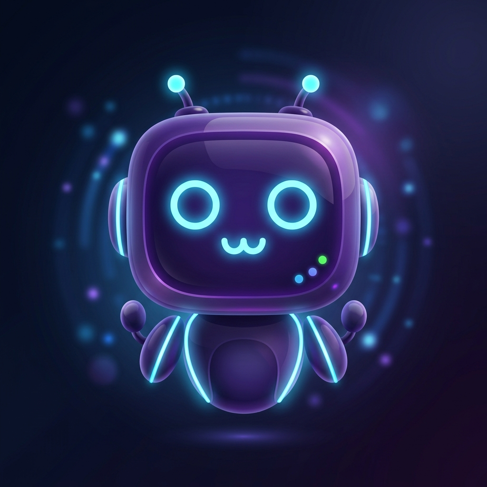
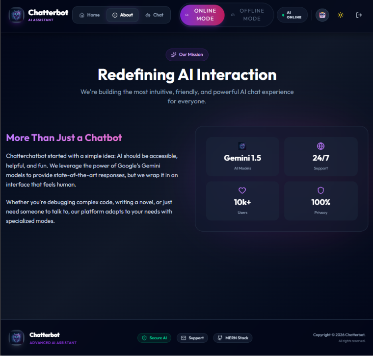
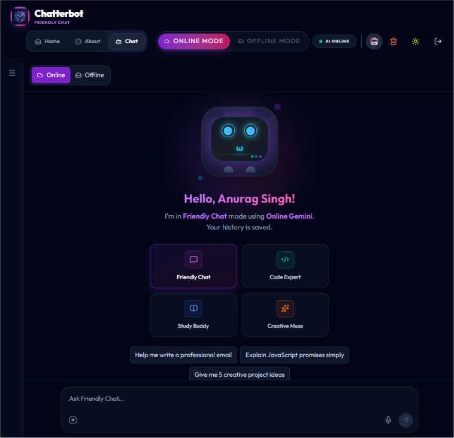
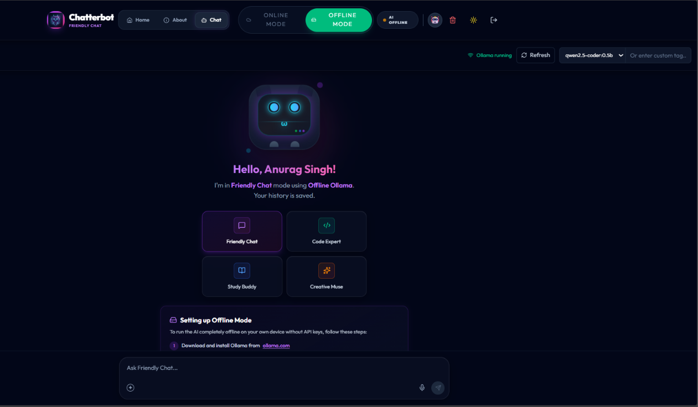
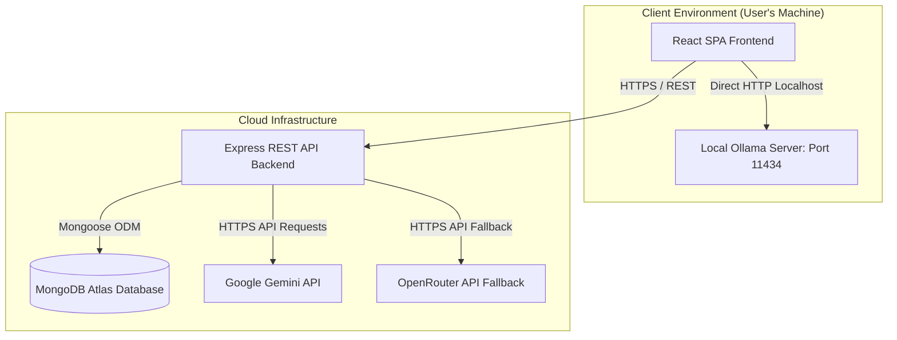
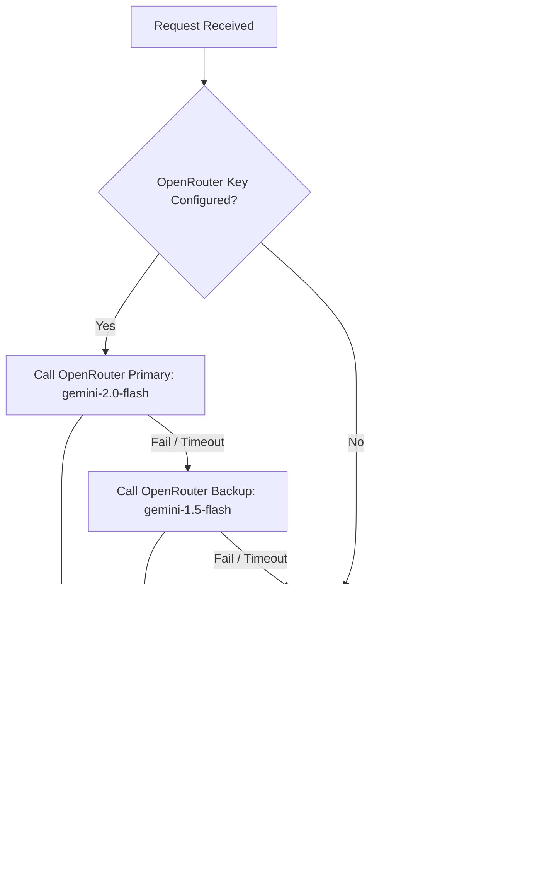
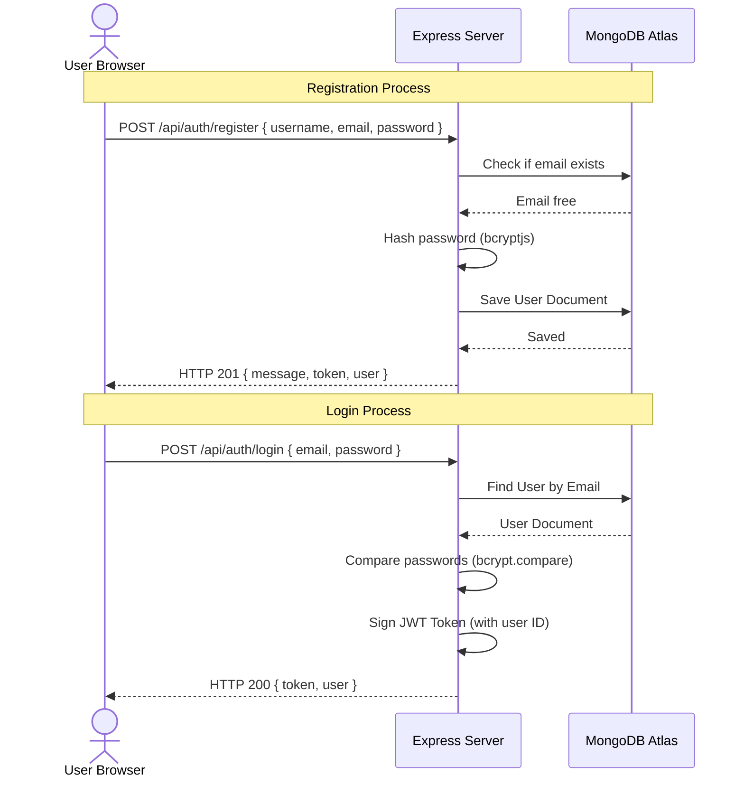
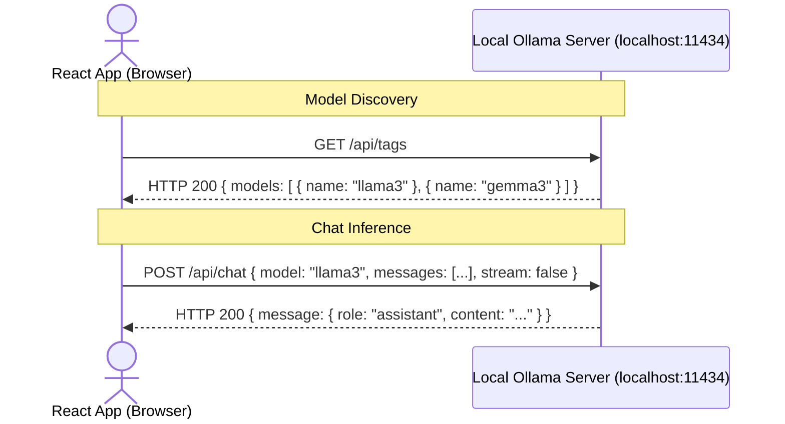

<div align="center">



# 🤖 Chatterbot — Ultimate Full-Stack AI Companion

**A production-ready, ultra-premium hybrid AI chatbot. Seamlessly transition between Google Gemini cloud-intelligence and 100% private, local Ollama inference.**

[](https://choosealicense.com/licenses/mit/)
[](https://nodejs.org/)
[](https://react.dev/)
[](https://tailwindcss.com/)
[](https://www.mongodb.com/)
[](https://ai.google.dev/)
[](https://ollama.com/)

[🌐 Live Demo](#) · [🐛 Report Bug](https://github.com/anuragsinghrajput123456789/Ai-Chatbot/issues) · [✨ Request Feature](https://github.com/anuragsinghrajput123456789/Ai-Chatbot/issues)

</div>

---

## 📸 App Screenshots & Interface Showcase

<table>
  <tr>
    <td align="center" width="33%">
      
      <br/><br/>
      <strong>🏠 Home — Hero Section</strong><br/>
      <em>Modern landing page with animated AI robot, mode switcher, and interactive prompt previews.</em>
    </td>
    <td align="center" width="33%">
      
      <br/><br/>
      <strong>ℹ️ About — Mission Page</strong><br/>
      <em>Clean dashboard showing live stats (Gemini 1.5, 10k+ Users, 24/7, 100% Privacy and Air-gapped options).</em>
    </td>
    <td align="center" width="33%">
      
      <br/><br/>
      <strong>💬 Chat — Interface</strong><br/>
      <em>Interactive sidebar with chat history, profile customized avatars, and responsive grid layouts.</em>
    </td>
  </tr>
  <tr>
    <td align="center" colspan="1">
      
      <br/><br/>
      <strong>🌐 Online Mode — Gemini AI</strong><br/>
      <em>Cloud-powered responses with persistent chat history, markdown code-block execution, and retry capabilities.</em>
    </td>
    <td align="center" colspan="1">
      
      <br/><br/>
      <strong>🔌 Offline Mode — Ollama</strong><br/>
      <em>100% local AI — auto-discovers models (Llama3, Gemma, etc.) in the user's host machine. Zero internet dependencies.</em>
    </td>
    <td align="center" colspan="1">
      
      <br/><br/>
      <strong>🤖 Chat Mode Selection</strong><br/>
      <em>Pick from 4 specialized prompts: Friendly Chat, Code Expert, Study Buddy, or Creative Muse.</em>
    </td>
  </tr>
</table>

---

## 🧭 Table of Contents

1. [✨ Key Features](#-key-features)
2. [🏗️ Architecture & System Topology](#️-architecture--system-topology)
3. [⚙️ Technical Stack](#️-technical-stack)
4. [📁 Folder Structure Mapping](#-folder-structure-mapping)
5. [🚀 Getting Started](#-getting-started)
   - [Prerequisites](#prerequisites)
   - [Cloning & Installing](#1-clone--install-all)
   - [Environment Configuration](#2-setup-the-backend)
   - [Running Local Development](#4-run-the-concurrent-dev-servers)
6. [🌐 Cloud vs. Local Flow Details](#-cloud-vs-local-flow-details)
7. [🤖 AI Chat Personalities](#-ai-chat-personalities)
8. [🔐 API Route Specifications](#-api-route-specifications)
9. [🛡️ Production Hardening & Security](#️-production-hardening--security)
10. [🏎️ Performance & Rendering Optimizations](#️-performance--rendering-optimizations)
11. [📦 Deployment Pipeline](#-deployment-pipeline)
12. [🤝 Contributing](#-contributing)
13. [📄 License](#-license)

---

## ✨ Key Features

* **🔌 Hybrid Hybrid Brains**: Toggle between **Google Gemini** cloud-intelligence via REST, and **Local Ollama** (`localhost:11434`) directly from the browser.
* **🤖 4 Specialized AI Personalities**: System prompts customize behavior dynamically:
  * **Friendly Chat**: Casual, warm daily conversations.
  * **Code Expert**: Deep-dive software engineering advisor.
  * **Study Buddy**: Step-by-step academic explanations and quizzes.
  * **Creative Muse**: Brainstorming partner for writing, design, and concepts.
* **💾 Cloud Persistence**: Real-time user state and thread management synchronized to Mongoose MongoDB Atlas collections.
* **🎨 Ultra-Premium UI**: Glassmorphic elements, backdrop filters (`blur(16px)`), customized robo-avatars, and silky smooth transition animations powered by Framer Motion.
* **🌗 Intelligent Theme Engine**: Dynamic light/dark settings integrated with state context.
* **📝 High-Fidelity Markdown Rendering**: Fully parsed markdown outputs with copyable syntax-highlighted code blocks.
* **🛡️ Hardened Security**: Anti-clickjacking headers, Express rate limits, mongo query sanitizers, password bcrypt-salting, and token-expiry session handlers.
* **⚡ 60FPS Scroll Acceleration**: Hardware-composited containers (`will-change: transform`) ensure lag-free scrolling during large conversation outputs.
* **🩺 Liveness & Readiness Probes**: Dedicated `/health/live` and `/health/ready` check points for continuous health monitoring and zero-downtime rollouts.
* **🐳 Container Orchestration**: Multi-stage `Dockerfile` and `docker-compose.yml` configured for quick self-hosted local or containerized cloud boots.
* **📝 High-Fidelity Markdown & Code**: Cleaned up layouts for headers, dynamic tables, blockquotes, list items, and syntax-highlighted code with an active blinking AI typing cursor.
* **🎨 Premium Actions Deck**: Reconfigured input text area into a rounded-2xl glass actions card that keeps tool buttons clustered at the bottom, mimicking ChatGPT/Claude.

---

## 🏗️ Architecture & System Topology

Chatterbot combines the security of a backend database proxy with the absolute privacy of local inference.

### System Topology Diagram


```mermaid
graph TD
    subgraph "Client Environment (User's Machine)"
        Browser[React SPA Frontend]
        Ollama[Local Ollama Server: Port 11434]
    end

    subgraph "Cloud Infrastructure"
        Backend[Express REST API Backend]
        MongoDB[(MongoDB Atlas Database)]
        Gemini[Google Gemini API]
        OpenRouter[OpenRouter API Fallback]
    end

    %% Online Flow
    Browser -->|HTTPS / REST| Backend
    Backend -->|Mongoose ODM| MongoDB
    Backend -->|HTTPS API Requests| Gemini
    Backend -->|HTTPS API Fallback| OpenRouter

    %% Offline Flow
    Browser -->|Direct HTTP Localhost| Ollama
```

### LLM Orchestration & Fallback Pipeline

In **Online Mode**, requests navigate a high-availability fallback structure:


```mermaid
graph TD
    Start[Request Received] --> CheckORKey{OpenRouter Key Configured?}
    
    %% OpenRouter Route
    CheckORKey -->|Yes| CallORPrimary[Call OpenRouter Primary: gemini-2.0-flash]
    CallORPrimary -->|Success| ReturnResponse[Return Response]
    CallORPrimary -->|Fail / Timeout| CallORBackup[Call OpenRouter Backup: gemini-1.5-flash]
    CallORBackup -->|Success| ReturnResponse
    CallORBackup -->|Fail / Timeout| CallNativePrimary[Call Native Gemini: gemini-2.5-flash]
    
    %% Native Gemini Route
    CheckORKey -->|No| CallNativePrimary
    CallNativePrimary -->|Success| ReturnResponse
    CallNativePrimary -->|Fail / Timeout| CallNativeBackup[Call Native Gemini Backup: gemini-1.5-flash]
    CallNativeBackup -->|Success| ReturnResponse
    CallNativeBackup -->|Fail / Timeout| ServiceUnavailable[Error: 503 Service Unavailable]
```

---

## ⚙️ Technical Stack

### Frontend Client
* **React 19.x & Vite 6.x** — Fast client bundles, hot-reloading.
* **Tailwind CSS v4** — Utility design token rules.
* **Framer Motion 12.x** — Interactive physics and layout animations.
* **React Router DOM 7.x** — Multi-page client-side SPA routing.
* **React Markdown 10.x & React Syntax Highlighter 16.x** — Streamlined code representation.
* **Lucide React** — High-quality interface glyphs.

### Backend Infrastructure
* **Node.js 18+ & Express 5.x (Beta)** — Scalable HTTP routing.
* **MongoDB & Mongoose 9.x** — Data persistence and ODM schema controls.
* **@google/genai 1.x** — Unified Google Gemini interface.
* **Helmet v8 & Express Rate Limit v8** — Request filtering and host protection.
* **Bcryptjs v3 & JSON Web Tokens v9** — Hashed authentication logic.
* **Compression v1** — Gzip compression proxying.

---

## 📁 Folder Structure Mapping

```
Ai_chatbot/
│
├── 📂 backend/                        # Express REST API Server
│   ├── 📂 config/
│   │   └── db.js                      # Database connection and retry policies
│   │
│   ├── 📂 controllers/
│   │   ├── authController.js          # Authentication, user registrations
│   │   └── chatController.js          # Gemini API interactions, message CRUD
│   │
│   ├── 📂 middlewares/
│   │   ├── authMiddleware.js          # JWT Verification Guard
│   │   ├── errorMiddleware.js         # Exception interceptor & status code maps
│   │   ├── notFoundMiddleware.js      # 404 Route handler
│   │   └── sanitizeMiddleware.js      # Anti-NoSQL Injection interceptor
│   │
│   ├── 📂 models/
│   │   ├── User.js                    # User Model & Password Hash hooks
│   │   └── Chat.js                    # Persistent chat history schema
│   │
│   ├── 📂 routes/
│   │   ├── auth.js                    # /api/auth/* bindings
│   │   └── chat.js                    # /api/chat/* bindings
│   │
│   ├── 📂 services/
│   │   └── geminiService.js           # External AI API Fallback orchestrator
│   │
│   ├── app.js                         # Middleware piping & asset distribution
│   └── server.js                      # Entry listener
│
├── 📂 frontend/                       # React client bundle
│   ├── 📂 public/
│   │   └── bot-logo.png               # Chatterbot branding assets
│   │
│   ├── 📂 src/
│   │   ├── 📂 components/
│   │   │   ├── Auth.jsx               # Auth Dialog overlays
│   │   │   ├── ChatInterface.jsx      # Core conversational screen logic
│   │   │   ├── ErrorBoundary.jsx      # React exception isolation layout
│   │   │   ├── KittyBot.jsx           # Animated robot canvas
│   │   │   ├── LandingPage.jsx        # Landing hero and features grid
│   │   │   └── Navbar.jsx             # Mode selector toggle controller
│   │   │
│   │   ├── 📂 context/
│   │   │   └── ChatSettingsContext.jsx # Global states (Auth, Theme, Offline mode)
│   │   │
│   │   ├── 📂 pages/
│   │   │   └── About.jsx              # Mission statement and system stats
│   │   │
│   │   ├── 📂 services/
│   │   │   ├── http.js                # Custom axios wrapper with auto-auth headers
│   │   │   └── ollamaService.js       # Local Ollama client logic
│   │   │
│   │   ├── App.jsx                    # Route mapping
│   │   ├── index.css                  # Global tailwind configurations & variables
│   │   └── main.jsx                   # DOM initialization
│   └── package.json
```

---

## 🚀 Getting Started

### Prerequisites

Ensure you have the following installed:
* **Node.js** `v18+` — [Install Node](https://nodejs.org/)
* **MongoDB** — Standard Atlas tier or local database instance.
* **Git** — [Install Git](https://git-scm.com/)
* *(Optional for Offline)* **Ollama** — [Download Ollama](https://ollama.com/)

---

### 1. Clone & Install All

We provide convenient workspace scripts to setup both modules simultaneously:

```bash
# Clone the repository
git clone https://github.com/anuragsinghrajput123456789/Ai-Chatbot.git
cd Ai-Chatbot

# Install all dependencies (Frontend and Backend) in one command
npm run install-all
```

---

### 2. Setup the Backend Environment

Navigate to the `backend/` folder and create your `.env` file:

```bash
cd backend
```

Create a `.env` file based on `.env.example`:

```env
PORT=5000
MONGO_URI=mongodb+srv://<username>:<password>@cluster0.your-hash.mongodb.net/chatterbot?retryWrites=true&w=majority
JWT_SECRET=your-random-cryptographic-secret-key-32chars
GEMINI_API_KEY=AIzaSyYourGoogleStudioGeminiKeyHere
OPENROUTER_API_KEY=sk-or-v1-yourOpenRouterKeyOptional
NODE_ENV=development
```

---

### 3. Setup Local Ollama (For Offline Mode)

If you wish to use local, private AI models, download Ollama and run:

```bash
# Pull your preferred model (e.g. Llama 3)
ollama pull llama3

# (Optional) Verify model catalog is running locally on port 11434
curl http://localhost:11434/api/tags
```

---

### 4. Run the Concurrent Dev Servers

Return to the project root directory and start both servers at once:

```bash
# Run both front-end and back-end concurrently
npm run dev
```

* **Frontend Client**: `http://localhost:5173`
* **Backend REST API**: `http://localhost:5000`

---

## 🌐 Cloud vs. Local Flow Details

### 🔐 Authentication & Session Persistence (Online)

All authenticated communications inside Online Mode rely on secure JWT delivery:


```mermaid
sequenceDiagram
    actor Client as User Browser
    participant API as Express Server
    participant DB as MongoDB Atlas

    %% Registration
    Note over Client, DB: Registration Process
    Client->>API: POST /api/auth/register { username, email, password }
    API->>DB: Check if email exists
    DB-->>API: Email free
    API->>API: Hash password (bcryptjs)
    API->>DB: Save User Document
    DB-->>API: Saved
    API-->>Client: HTTP 201 { message, token, user }

    %% Login
    Note over Client, DB: Login Process
    Client->>API: POST /api/auth/login { email, password }
    API->>DB: Find User by Email
    DB-->>API: User Document
    API->>API: Compare passwords (bcrypt.compare)
    API->>API: Sign JWT Token (with user ID)
    API-->>Client: HTTP 200 { token, user }
```

---

### 🔌 Direct Browser-to-Ollama Local Bypassing (Offline)

When toggled to **Offline Mode**, the browser completely bypasses the cloud server stack and talks to `localhost:11434` over a direct HTTP connection, keeping your sensitive data private:


```mermaid
sequenceDiagram
    actor Client as React App (Browser)
    participant Ollama as Local Ollama Server (localhost:11434)

    Note over Client, Ollama: Model Discovery
    Client->>Ollama: GET /api/tags
    Ollama-->>Client: HTTP 200 { models: [ { name: "llama3" }, { name: "gemma3" } ] }

    Note over Client, Ollama: Chat Inference
    Client->>Ollama: POST /api/chat { model: "llama3", messages: [...], stream: false }
    Ollama-->>Client: HTTP 200 { message: { role: "assistant", content: "..." } }
```

---

## 🤖 AI Chat Personalities

Each character configuration injects specialized instructions into the LLM system parameters:

| Character | Mode Icon | Primary Instruction Strategy | Prompt Example |
|---|---|---|---|
| **Friendly Chat** | 💬 | Act as a general-purpose, polite, conversational companion. | *"Draft a short welcome message for my community newsletter"* |
| **Code Expert** | `</>` | Act as an expert senior compiler and systems engineer. Output high-efficiency clean code, formatting markdown accurately. | *"Explain JavaScript event loops and promises in 3 bullet points"* |
| **Study Buddy** | 📖 | Act as an encouraging educational mentor. Structure information progressively, providing checklists and quizzes. | *"Why does seawater contain salinity?"* |
| **Creative Muse** | ✨ | Act as an artistic assistant. Generate out-of-the-box storylines, dynamic descriptions, and brand assets. | *"Write a cyberpunk plot hook about an AI learning to dream"* |

---

## 🔐 API Route Specifications

All backend endpoints are prefixed with `/api`.

### Auth Endpoints

| Method | Endpoint | Description | Auth Required |
|---|---|---|---|
| `POST` | `/auth/register` | Signs up a new user (with email formats & username validations) | ❌ |
| `POST` | `/auth/login` | Yields authenticated JWT token matching verified credentials | ❌ |
| `PATCH` | `/auth/profile/avatar` | Updates user's custom robotic avatar identifier | ✅ |

### Chat Endpoints

| Method | Endpoint | Description | Auth Required |
|---|---|---|---|
| `POST` | `/chat` | Submits prompt to cloud model pipeline & returns thread details | Optional (Guests supported) |
| `GET` | `/chat` | Fetches all authenticated threads for the user | ✅ |
| `GET` | `/chat/:chatId` | Retrieves complete messages array within a specified session | ✅ |
| `PATCH` | `/chat/:chatId/title` | Renames the conversational thread title | ✅ |
| `DELETE` | `/chat/:chatId` | Deletes a thread from Mongoose | ✅ |
| `DELETE` | `/chat` | Wipes the user's entire thread history from MongoDB | ✅ |
| `PATCH` | `/chat/messages/:messageId` | Edits the text content of a specific message | ✅ |
| `DELETE` | `/chat/messages/:messageId` | Deletes a specific message inside a thread | ✅ |

---

## 🛡️ Production Hardening & Security

Chatterbot implements defenses against common security exploits:

* **⚡ Sequential Server Startup**: The server establishes a connection to MongoDB *before* binding to the network socket, preventing half-boot crashes.
* **🛡️ Helmet.js Integration**: Configures secure HTTP headers to prevent Clickjacking and basic XSS attacks.
* **🚫 Express Rate Limiting**: Restricts client requests to a maximum of 500 per 15 minutes per IP address.
* **🧬 NoSQL injection prevention**: Cleans user input, filtering queries containing Mongo operators (`$` and `.`).
* **🗝️ Alphanumeric Signup Validation**: Restricts usernames to letters and numbers, preventing injection in database queries.
* **⏱️ Request Timeout Guards**: Uses a 15-second `AbortSignal` on the backend for Gemini calls and a 5-second `AbortSignal` on the frontend for Ollama calls, keeping the connection pool clean.
* **🚫 401 Session Interceptor**: Stale tokens trigger immediate logout, clearing local storage.
* **🔐 Strict Environment Validator**: Synchronously validates mandatory configurations (`JWT_SECRET`, `MONGO_URI`) on server boot, terminating with exit code 1 if missing to avoid runtime failures.
* **🛡️ Custom CSP Rules**: Customized Content Security Policy in Helmet allows client fetches to local Ollama nodes (`localhost:11434` / `127.0.0.1:11434`) while securing external resources.
* **📈 Request Tracing & Observability**: Backend logging middleware injects unique tracing ids (`x-request-id`) and outputs execution latency in milliseconds to stdout.

---

## 🏎️ Performance & Rendering Optimizations

### 1. Hardware-Accelerated Layout Compositing
Long conversation screens use the `will-change: transform` styling property. This signals the browser to offload layout painting to the GPU, preventing frame drops during high-speed scrolling:
```css
.chat-scroll-container {
  will-change: transform;
  overflow-y: auto;
  scroll-behavior: smooth;
}
```

### 2. Manual Rollup Vendor Chunking
Vite isolates large external node dependencies (`react`, `react-markdown`, `react-syntax-highlighter`) into separate modules, optimizing browser loading speed:
```javascript
// vite.config.js
export default defineConfig({
  build: {
    rollupOptions: {
      output: {
        manualChunks: {
          vendor: ['react', 'react-dom', 'react-router-dom'],
          markdown: ['react-markdown', 'remark-gfm'],
          highlight: ['react-syntax-highlighter'],
        }
      }
    }
  }
});
```

---

## 📦 Deployment Pipeline

### Frontend (Deploying to Vercel)
Chatterbot includes a pre-configured `vercel.json` to handle client-side SPA routing:
```json
{
  "rewrites": [
    { "source": "/(.*)", "destination": "/index.html" }
  ]
}
```
1. Connect your repository to [Vercel](https://vercel.com).
2. Set the root directory to `frontend`.
3. Build command: `npm run build`.
4. Output directory: `dist`.

### Backend (Deploying to Render or Railway)
1. Add environment variables in your hosting provider's dashboard.
2. Set the startup script: `node server.js` (pointing to `backend/server.js`).
3. Set the build step: `npm install` (within `backend`).

### Docker Deployment (Self-Hosted Orchestration)
You can run the entire database and application stack locally using Docker:
```bash
# Build and boot the entire stack (App + MongoDB)
docker-compose up --build -d
```
The unified monolith application will be available at `http://localhost:5000`.

---

## 🤝 Contributing

Contributions are what make the open source community such an amazing place to learn, inspire, and create. Any contributions you make are **greatly appreciated**.

1. Fork the Project
2. Create your Feature Branch (`git checkout -b feature/AmazingFeature`)
3. Commit your Changes (`git commit -m 'feat: add some AmazingFeature'`)
4. Push to the Branch (`git push origin feature/AmazingFeature`)
5. Open a Pull Request

---

## 📄 License

Distributed under the MIT License. See `LICENSE` for more information.

---

<div align="center">

**Crafted with ❤️ by [Anurag Singh Rajput](https://github.com/anuragsinghrajput123456789)**

⭐ **Star this repository** if you found it useful!

[](https://github.com/anuragsinghrajput123456789/Ai-Chatbot/stargazers)
[](https://github.com/anuragsinghrajput123456789/Ai-Chatbot/network/members)

</div>
