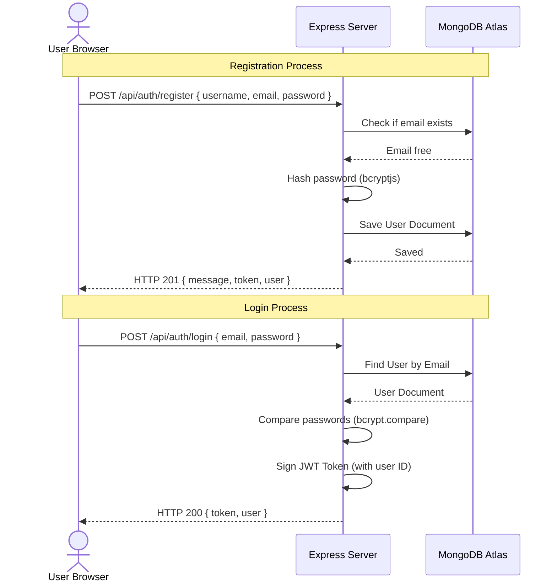
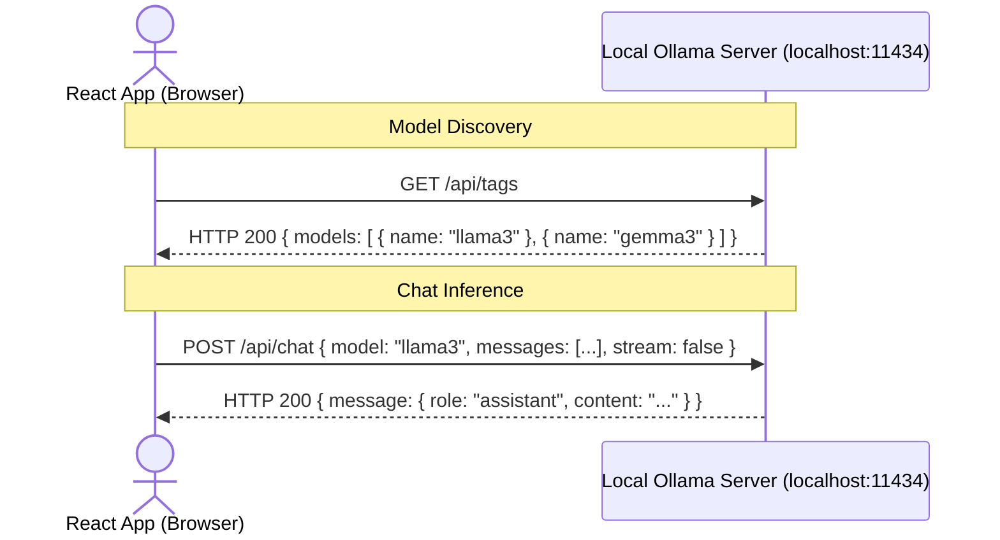

# 🔄 API Flow and Integrations

This document describes the API interface, request/response structures, authorization flows, and client-to-local bypassing mechanisms.

---

## 🔐 Authentication Flow

Chatterbot uses stateless **JSON Web Tokens (JWT)** for session authentication.



### Authorization Header
All protected API endpoints require the token to be sent in the `Authorization` request header:
```http
Authorization: Bearer <your_jwt_token>
```

---

## 🌐 Online Chat API Endpoints

All online routes reside under the `/api/chat` prefix.

### 1. Send Message
* **Endpoint**: `POST /api/chat`
* **Auth**: Optional (Guests supported, but messages will not be persisted in MongoDB).
* **Payload**:
  ```json
  {
    "message": "Explain JavaScript promises simply",
    "systemPrompt": "You are a senior developer...",
    "mode": "online",
    "chatId": "64f1bc09a47519a77f2409ba" 
  }
  ```
  *(Note: `chatId` is optional; if omitted, a new chat session is generated.)*
* **Response (HTTP 200)**:
  ```json
  {
    "reply": "A promise in JavaScript is...",
    "chatId": "64f1bc09a47519a77f2409ba",
    "messages": [
      { "_id": "msg_01", "role": "user", "text": "Explain JavaScript promises simply" },
      { "_id": "msg_02", "role": "model", "text": "A promise in JavaScript is..." }
    ],
    "onlineUseCount": 14
  }
  ```

### 2. Rename Chat Session
* **Endpoint**: `PATCH /api/chat/:chatId/title`
* **Auth**: Required
* **Payload**:
  ```json
  {
    "title": "React Hooks Discussion"
  }
  ```
* **Response (HTTP 200)**:
  ```json
  {
    "message": "Chat renamed successfully",
    "chat": {
      "_id": "64f1bc09a47519a77f2409ba",
      "title": "React Hooks Discussion"
    }
  }
  ```

### 3. Update Message Text
* **Endpoint**: `PATCH /api/chat/messages/:messageId`
* **Auth**: Required
* **Payload**:
  ```json
  {
    "text": "What are React hooks?"
  }
  ```
* **Response (HTTP 200)**:
  ```json
  {
    "message": {
      "_id": "64f1bc55a47519a77f2409bb",
      "role": "user",
      "text": "What are React hooks?"
    },
    "messages": [ ... ]
  }
  ```

### 4. Delete Chat Session
* **Endpoint**: `DELETE /api/chat/:chatId`
* **Auth**: Required
* **Response (HTTP 200)**:
  ```json
  {
    "message": "Chat history deleted successfully"
  }
  ```

---

## 🔌 Offline Direct Browser-to-Ollama Flow

In **Offline Mode**, the browser bypasses the Node.js backend completely to run inference locally. 



### Local API Configurations

1. **Tag Check (Model Discovery)**:
   * **Endpoint**: `GET http://localhost:11434/api/tags`
   * **Purpose**: Discovers what LLMs are installed and available on the machine.
   * **Response Payload**:
     ```json
     {
       "models": [
         {
           "name": "llama3:latest",
           "modified_at": "2026-07-24T12:00:00Z",
           "size": 4661224673,
           "digest": "78e268..."
         }
       ]
     }
     ```

2. **Inference Request**:
   * **Endpoint**: `POST http://localhost:11434/api/chat`
   * **Payload**:
     ```json
     {
       "model": "llama3",
       "messages": [
         { "role": "system", "content": "You are a senior developer..." },
         { "role": "user", "content": "Write a python quicksort script" }
       ],
       "stream": false
     }
     ```
   * **Response Payload**:
     ```json
     {
       "model": "llama3",
       "created_at": "2026-07-24T12:01:05Z",
       "message": {
         "role": "assistant",
         "content": "Here is the python quicksort code: ..."
       },
       "done": true
     }
     ```
