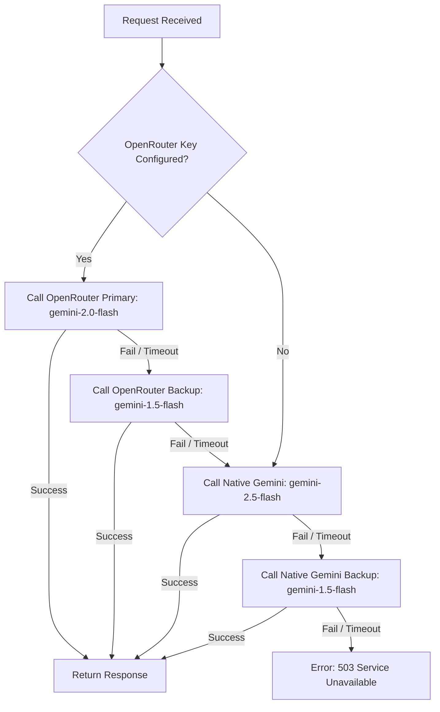

# 🏗️ Chatterbot Architecture

This document provides a comprehensive overview of the system architecture, component layout, and data-flow patterns of **Chatterbot**.

---

## 🧭 System Topology

Chatterbot uses a hybrid online/offline architecture. It is designed to work in two modes:
1. **Cloud-Powered (Online) Mode**: A classic multi-tier architecture using a React Single Page Application (SPA), a Node/Express REST API backend, and a MongoDB database, with Google Gemini serving as the intelligence engine.
2. **Local (Offline) Mode**: A peer-to-peer/on-device architecture where the React SPA runs directly in the client's browser and communicates with a local **Ollama** server running on the user's host machine (`localhost:11434`), completely bypassing the backend server and database.

```mermaid
graph TD
    subgraph Client Environment (User's Machine)
        Browser[React SPA Frontend]
        Ollama[Local Ollama Server: Port 11434]
    end

    subgraph Cloud Infrastructure
        Backend[Express REST API Backend]
        MongoDB[(MongoDB Atlas Database)]
        Gemini[Google Gemini API]
        OpenRouter[OpenRouter API Fallback]
    end

    %% Online Flow
    Browser -->|HTTPS / REST| Backend
    Backend -->|Mongoose ODM| MongoDB
    Backend -->|HTTPS API Requests| Gemini
    Backend -->|HTTPS API Fallback| OpenRouter

    %% Offline Flow
    Browser -->|Direct HTTP Localhost| Ollama
```

---

## 🖥️ Component Architecture

### 1. Frontend SPA (React 19 + Vite 6)
The frontend is built using standard React components, styled with Tailwind CSS v4, and compiled via Vite v6. 
* **State Management**: Uses React's Context API via [ChatSettingsContext.jsx](file:///c:/Users/91836/Downloads/Mern-Ai-Projects/Ai_chatBot_offline_online/frontend/src/context/ChatSettingsContext.jsx) to sync:
  * Authentication states (JWT storage and validation).
  * Active chat session parameters.
  * Selected mode (Online vs. Offline).
  * Current personality/mode configuration (Friendly, Code Expert, Study Buddy, Creative Muse).
  * Dark/Light theme values.
* **Router**: Managed by `react-router-dom` v7 to handle clean route transitions between `LandingPage`, `ChatInterface`, and `About`.
* **Markdown Renderer**: Parses AI responses into clean, responsive HTML using `react-markdown`. Includes syntax highlighting for code blocks via `react-syntax-highlighter` and an instant "copy-to-clipboard" system.

### 2. Backend Server (Express 5.x)
The backend functions as a secure, stateless proxy and persistent layer for Online Mode.
* **Server Lifecycle**: Implements a sequential database-first boot sequence. The Express app will not bind to network sockets until the MongoDB connection is fully established.
* **Security Layer**:
  * **Helmet**: Configures HTTP response headers (disabling CSP to allow the React SPA to load resources, while keeping standard protections active).
  * **Rate Limiter**: Blocks abuse by limiting clients to 500 requests per 15 minutes.
  * **Mongo Sanitize**: Intercepts requests and strips `$`/`.` keys to prevent NoSQL injection attacks.
  * **CORS**: Dynamically matches incoming headers against allowed origins (`FRONTEND_URL` and dev ports).
* **Services**: Encapsulates external API integrations into reusable utility functions.

---

## 🗄️ Database Schema & Persistence

Chatterbot uses MongoDB Atlas with two schemas designed using Mongoose:

### 1. User Schema (`User.js`)
Stores user identities, credentials, and utilization counts.
* **Properties**:
  * `username`: Alphanumeric string, length enforced between 3-20 characters.
  * `email`: Lowercased, indexed, and validated email address.
  * `password`: Salted and hashed using `bcryptjs`.
  * `avatar`: Short identifier representing the chosen robotic avatar avatar visual.
  * `onlineUseCount`: Incrementing counter tracking total online API generations.

### 2. Chat Schema (`Chat.js`)
Manages persistent conversational sessions and lists of messages.
* **Properties**:
  * `userId`: Reference ID linking to the `User` document.
  * `title`: Dynamically generated string from the initial user prompt.
  * `messages`: Subdocument array containing:
    * `role`: Either `user` or `model`.
    * `text`: Enforced maximum limit of 10,000 characters.
    * `timestamp`: Creation date.

---

## 🔌 AI Integration Logic

### 1. Gemini / OpenRouter Orchestration
The backend coordinates LLM requests using a nested fallback pipeline. This strategy maximizes availability even during API rate limits or outages:



### 2. Offline Inference Bypassing
Offline mode bypasses the backend and database completely. 
* The React application uses [ollamaService.js](file:///c:/Users/91836/Downloads/Mern-Ai-Projects/Ai_chatBot_offline_online/frontend/src/services/ollamaService.js) to issue local HTTP calls.
* Connects directly to `http://localhost:11434/api/tags` to fetch models and `/api/chat` to send prompts.
* Conversation state is maintained entirely in the frontend React state.
